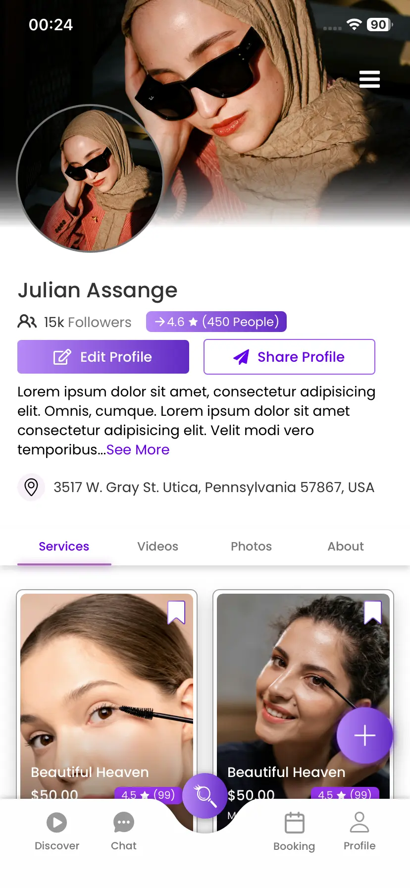
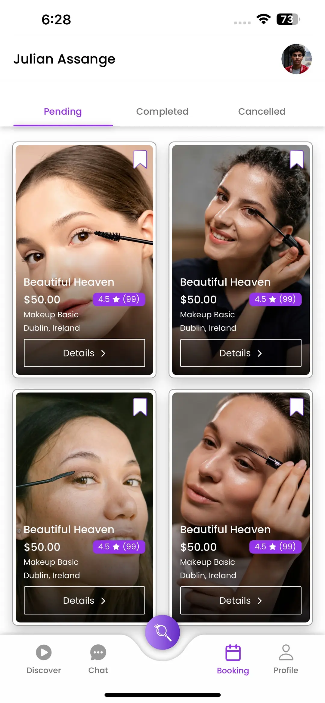
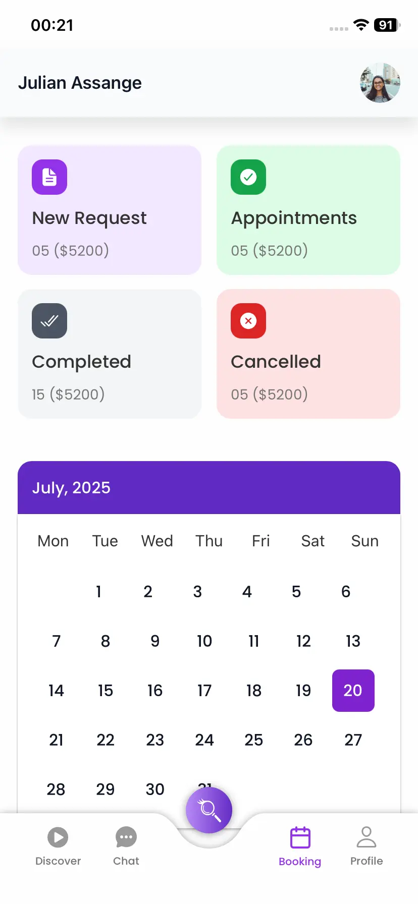
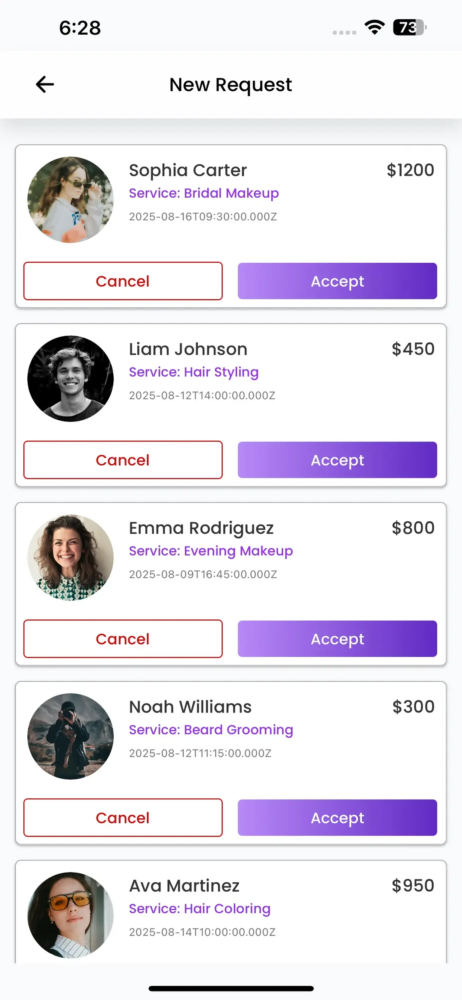
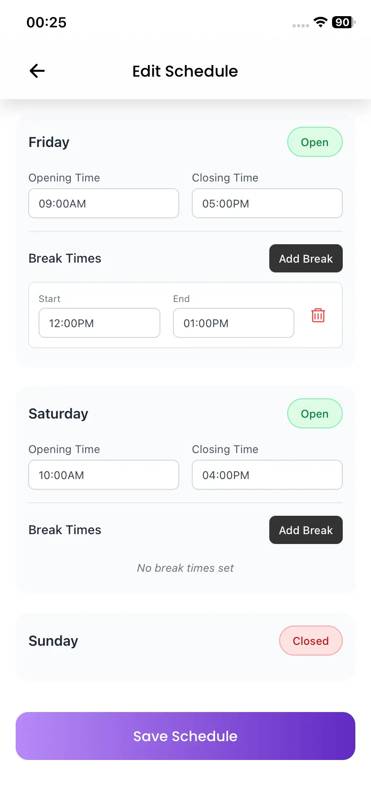
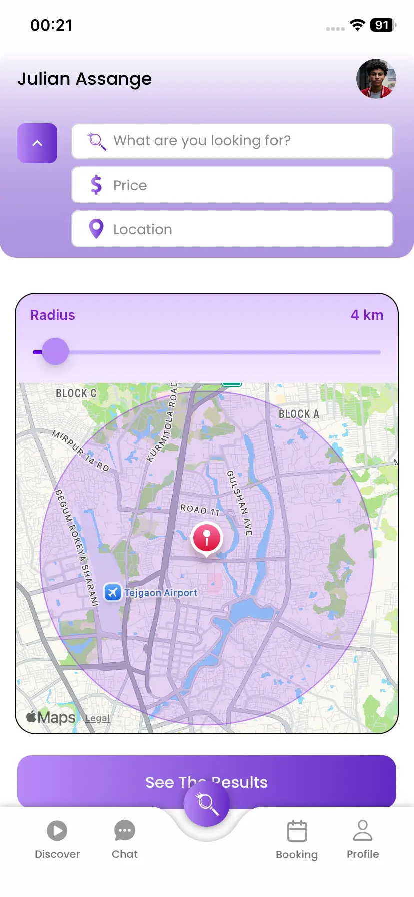

# Beauty Checker 💅✨

> A modern, feature-rich cross-platform mobile application for discovering beauty services, scheduling appointments, and managing service provider workflows. Built with **React Native**, **Expo Router**, **TypeScript**, and **NativeWind**.

---

## 📱 App Screenshots

| Provider Profile | Booking Management | Dashboard & Calendar |
| :---: | :---: | :---: |
|  |  |  |
| **Profile Showcase** | **Bookings View** | **Dashboard Stats** |

| New Requests | Schedule Manager | Map & Radius Search |
| :---: | :---: | :---: |
|  |  |  |
| **Request Approvals** | **Working Hours** | **Mapbox Integration** |

---

## ✨ Features

- **👥 Dual User Experience**: Dedicated workflows for **Customers** looking to book appointments and **Providers** managing their beauty business.
- **🗺️ Interactive Map & Location Search**: Location-aware provider search using **Mapbox** maps with configurable distance radius slider, price range filter, and service categories.
- **📅 Provider Dashboard & Calendar**: Overview of appointment statistics (New Requests, Active Appointments, Completed, Cancelled) alongside a monthly calendar.
- **⚡ Booking & Request Approvals**: Real-time request management allowing providers to accept or decline bookings with price and timing details.
- **⏰ Flexible Schedule Management**: Provider working hours configuration, break time intervals, and day availability toggles.
- **🌟 Rich Media Provider Profiles**: Showcase portfolios with photos and video thumbnails, service menus, pricing, ratings, location details, and follower system.
- **🔔 Push Notifications**: Integrated **Firebase Cloud Messaging (FCM)** and **Expo Notifications** for real-time appointment updates and alerts.
- **🔒 Secure Authentication**: Firebase Auth supporting Google Sign-In and local session persistence.

---

## 🛠️ Tech Stack

### **Frontend & Framework**
- **[React Native](https://reactnative.dev/)** (`0.81.5`) & **[React](https://react.dev/)** (`19.1.0`)
- **[Expo SDK 54](https://expo.dev/)** - Cross-platform development platform
- **[Expo Router v6](https://docs.expo.dev/router/introduction/)** - File-based routing for React Native
- **[TypeScript](https://www.typescriptlang.org/)** - Strongly typed application logic

### **Styling & UI Components**
- **[NativeWind v4](https://www.nativewind.dev/)** - Tailwind CSS framework for React Native
- **[Expo Vector Icons](https://icons.expo.fyi/)** & **React Native Vector Icons**
- **[Expo Blur & Linear Gradient](https://docs.expo.dev/versions/latest/sdk/linear-gradient/)** - Modern UI visual effects

### **Maps & Geolocation**
- **[@rnmapbox/maps](https://github.com/rnmapbox/maps)** - Interactive vector maps integration
- **[Expo Location](https://docs.expo.dev/versions/latest/sdk/location/)** - Geolocation and coordinate tracking

### **State Management & Storage**
- **[Zustand](https://github.com/pmndrs/zustand)** - Lightweight and scalable state management
- **[AsyncStorage](https://react-native-async-storage.github.io/async-storage/)** - Local key-value storage

### **Backend & Services**
- **[Firebase App & Messaging](https://rnfirebase.io/)** - Push notifications (FCM) & cloud infrastructure
- **[Google Sign-In](https://github.com/react-native-google-signin/google-signin)** - Social authentication

---

## 📁 Project Structure

```
Beauty-Checker/
├── app/                      # Expo Router navigation & screens
│   ├── (auth)/               # Login & Registration screens
│   ├── (tabs)/               # Tab-based main navigation
│   ├── chat/                 # Messaging & Chat screens
│   ├── customer-booking/     # Customer booking flows
│   ├── provider-booking/     # Provider booking management
│   ├── provider-profile/     # Provider dashboard & management
│   ├── search/               # Map & location search
│   └── role-selection.tsx    # Role picker (Customer vs Provider)
├── assets/                   # App assets
│   ├── images/               # SVGs, icons, and UI assets
│   ├── fonts/                # Custom typography (Poppins, Inter)
│   └── screenshots/          # README showcase screenshots
├── components/               # Reusable UI components
│   ├── Auth/                 # Auth UI components
│   ├── Booking/              # Booking cards & lists
│   ├── Chat/                 # Chat UI components
│   ├── Discover/             # Media & service discovery cards
│   ├── Profile/              # Profile headers & edit forms
│   └── Search/               # Map controls & search filters
├── services/                 # API, Firebase FCM, and Storage services
├── store/                    # Zustand global state stores
└── types/                    # TypeScript interfaces & types
```

---

## 🚀 Getting Started

### Prerequisites

Ensure you have the following installed on your development machine:
- **Node.js** (v18 or higher recommended)
- **npm** or **yarn** / **pnpm**
- **Expo Go** app on your iOS/Android device OR Android Studio / Xcode for emulators

### Installation

1. **Clone the repository**:
   ```bash
   git clone https://github.com/your-username/Beauty-Checker.git
   cd Beauty-Checker
   ```

2. **Install dependencies**:
   ```bash
   npm install
   ```

3. **Configure Environment**:
   Copy `.env.example` to `.env` and fill in required credentials (Mapbox tokens, Firebase credentials):
   ```bash
   cp .env.example .env
   ```

4. **Start the Expo Development Server**:
   ```bash
   npx expo start
   ```

5. **Run on Emulator / Device**:
   - Press `a` for **Android Emulator**
   - Press `i` for **iOS Simulator**
   - Scan the QR code using **Expo Go** (Android) or Camera app (iOS)

---

## 📜 Available Scripts

| Script | Command | Description |
| :--- | :--- | :--- |
| `npm start` | `expo start` | Starts the Expo development server |
| `npm run android` | `expo run:android` | Builds and runs the app on Android device/emulator |
| `npm run ios` | `expo run:ios` | Builds and runs the app on iOS simulator |
| `npm run web` | `expo start --web` | Runs the app in a web browser |
| `npm run lint` | `expo lint` | Checks code formatting & lint issues |

---

## 📄 License

This project is licensed under the **Creative Commons Attribution-NonCommercial 4.0 International (CC BY-NC 4.0)** license.

See the full [LICENSE](LICENSE) file for details. You are free to share and adapt this material for non-commercial purposes as long as appropriate credit is given to the author.
